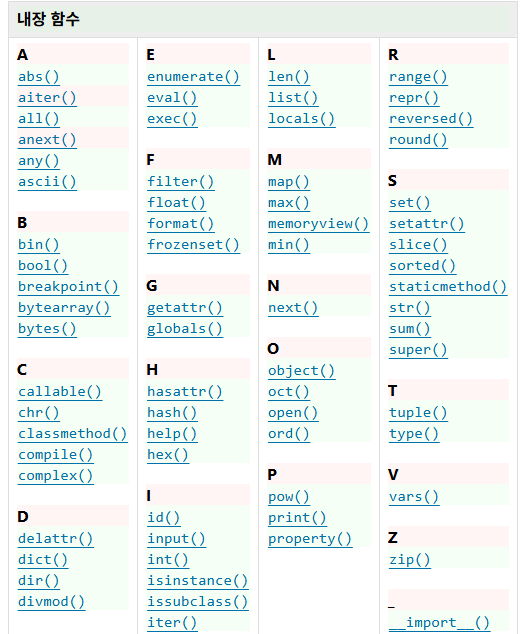

## 함수
함수의 정의 : 특정 작업을 수행하기 위한 재사용 가능한 코드 묶음
함수 구조
input > docstrin(선택사항) > function body(핵심로직) > output
**함수 정의 예제**
```python
def make_sum(x , y):
  """
  이것은 두 수를 파라미터로 받아
  두 수의 합을 반환하는 함수입니다.
  """
  result = x + y
  return result
```

**함수 호출 및 반환 값 할당**
```python
result = make_sum(100, 200)
print(result)

#[번외] print 함수는 반환값이 없다.
result2 = print(100)
print(result2) #None
```
**위치 인자가 앞에 와야 할까?** 
  위치 인자가 키워드 인자보다 반드시 먼저 와야 하는 이유는 "순서의 모호성" 때문
**임의 인자 목록**
-정해지지 않은 개수의 인자를 처리하는 인자
-함수 정의 시 매개변수 앞에 '*'를 붙여 사용

## 재귀 함수
  -정의 : 함수 내부에서 자기 자신을 호출하는 함수
  -특징 : 특정 알고리즘 식을 표현할 때 변수의 사용이 줄어들며, 코드의 가독성이 높아짐
  -**종료 조건을 명확히 할 것**
  -**반복되는 호출이 종료 조건을 향하도록 할 것**

내장함수 : 파이썬에 기본적으로 내장된 함수


[참고]함수의 스타일 가이드
  -소문자와 언더스코어 사용
  -동사로 시작하여 함수의 동작 설명
  -약어 사용 지양

**단일 책임 원칙**
모든 객체는 하나의 명확한 목적과 책임만을 가져야함